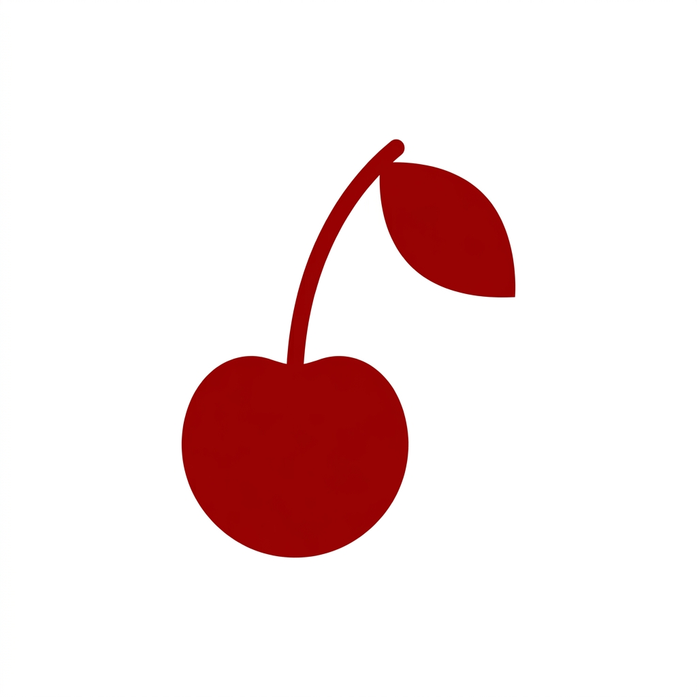

<p align="center">
  
</p>

<h1 align="center">CherryNote</h1>

<p align="center">
  <strong>Ultra-Lightweight. Borderless. iOS-Inspired. Native Win32.</strong>
</p>

<p align="center">
  
  
  
  
</p>

---

**CherryNote** is a modern, borderless floating widget designed for speed and aesthetics. Built with pure C and the raw Win32 API, it offers a glassmorphic iOS-style experience with zero bloat. It's not just a note; it's a fixed part of your workflow.

##  Why CherryNote?

Unlike standard post-it apps, CherryNote is designed to be invisible when you don't need it and stunningly present when you do.

- ** Performance**: Native C execution with less than 2MB RAM usage. Instant startup.
- ** Aesthetics**: iOS-style traffic light buttons, smooth gradients, and borderless design with rounded corners.
- ** Shade Mode**: Slide the notes away into a compact header bar with one click.
- ** Secure & Private**: Saves locally to a plain text file. No cloud, no tracking.

##  Features

- **Smart Task Management**:
  - `Ctrl + Enter`: Automatic numbering for tasks.
  - `Ctrl + D`: Toggle completion status with clean strikethrough logic.
- **Interactive Controls**:
  - **Red Circle**: Quick Close.
  - **Yellow Circle**: Shade Mode (Collapse to Header).
  - **Blue Circle**: Master Lock (Toggle Move/Resize).
- **Universal Drag**: Move it from anywhere on the window (when unlocked).
- **Auto-Save**: Forget about hitting save; your notes are persisted instantly.

##  Installation & Build

### Binary
Download the latest `CherryNote.exe` from the [Releases](https://github.com/Luohino/CherryNote/releases) tab.

### Build from Source
Ensure you have **GCC (MinGW)** installed.

```powershell
gcc CherryNote.c -o CherryNote.exe -lgdi32 -lcomctl32 -luser32 -lmsimg32 -mwindows -municode
```

##  Shortcuts

| Key | Action |
| :-- | :--- |
| `Ctrl + Enter` | New numbered task |
| `Ctrl + D` | Toggle strikethrough |
| `Ctrl + A` | Select all text |
| `Blue Button` | Lock/Unlock Drag & Resize |
| `Yellow Button` | Shade Mode |

